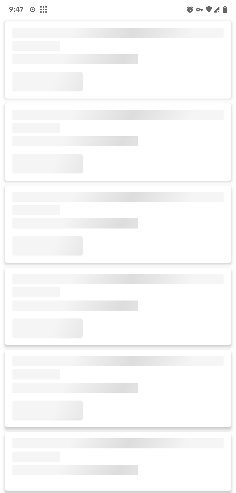

# HackerNews-KT

Basic Newbie HackerNews App made while learning Kotlin & Stuff

## Libraries Used

- Hilt
- Lottie
- LiveData
- Moshi
- Paging
- Retrofit
- ViewModel

## Screenshots

  
  
  

## Credits

Thanks to [Lim Chee Aun](https://github.com/cheeaun/node-hnapi) for the Unofficial HackerNews API